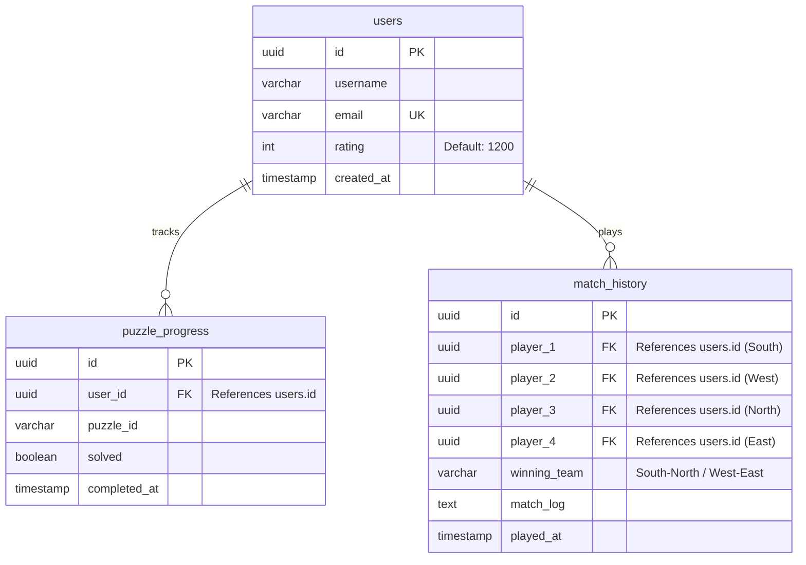
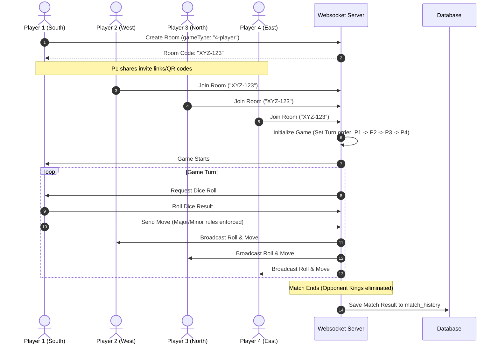

# Chaturanga Game Launch & Deployment Guide

This guide provides a comprehensive checklist, technical blueprint, and strategic recommendations for hosting, deploying, and launching the Chaturanga game website based on the official rules of the **IoT-based 4-Player Chaturanga Board (SIH 2026)**.

---

## 1. Hosting & Deployment Strategy

For a real-time multiplayer board game, a decoupled architecture (separating frontend, database, and real-time communication) provides the best performance and cost-efficiency.

| Component | Technology Options | Hosting Provider | Cost Tier |
| :--- | :--- | :--- | :--- |
| **Frontend UI** | Next.js, React, or Vite (JS/TS) | **Vercel** or **Netlify** | Free / Hobby Tier |
| **User Database & Auth** | Supabase (PostgreSQL) or Firebase | **Supabase** (Managed Cloud) | Free Tier (up to 500MB DB) |
| **Real-time Multiplayer** | Socket.io (Node.js) or Supabase Realtime | **Render** / **Fly.io** (for Socket.io) | Free / ~$5/month |
| **Domain & DNS** | Cloudflare DNS (Free Proxy/CDN) | Any Registrar (Namecheap/Porkbun) | ~$10 - $12/year |

### Best-Practice Deployment Flow
1. **Repository Hosting**: Host code on **GitHub**.
2. **CI/CD Pipeline**: Connect the repository to **Vercel**. Every push to the `main` branch will trigger an automatic production build and deployment.
3. **Domain Proxying**: Purchase a custom domain and route its DNS through **Cloudflare** to gain free SSL certificates, DDoS protection, and global CDN caching.

---

## 2. Marketing, Legal, and Search Engine Optimization (SEO)

To successfully list on search engines and comply with global privacy rules, several assets must be prepared before launch.

### A. Search Engine Optimization (SEO)
To capture traffic from search terms like *"play 4 player chaturanga"* or *"ancient indian chess board online"*:
*   **Semantic HTML**: Ensure only one `<h1>` exists per page. Use structural tags like `<main>`, `<section>`, and `<nav>`.
*   **Essential Meta Tags**: Ensure every page has descriptive titles and meta descriptions:
    ```html
    <title>Play 4-Player Chaturanga Online - SIH 2026 Edition</title>
    <meta name="description" content="Play the ancient strategic 4-player Chaturanga game online on an 8x8 Ashtapada grid with dice mechanics. Solve tactical puzzles, play with bots, and invite friends.">
    ```
*   **Open Graph (OG) Tags**: Crucial for social sharing. When users share your invite links on WhatsApp, Discord, or iMessage, these tags render a rich preview card with a thumbnail image of the board.
*   **Sitemap & Robots.txt**: Configure `robots.txt` to permit search engines to index your pages and generate a dynamic `sitemap.xml` mapping your home, play, puzzles, and about pages.
*   **JSON-LD Schema**: Embed structured data on the home page to tell Google search bots that this is a playable web game:
    ```json
    {
      "@context": "https://schema.org",
      "@type": "VideoGame",
      "name": "Chaturanga",
      "genre": "Strategic Board Game",
      "playMode": ["Multiplayer"],
      "applicationCategory": "Game",
      "operatingSystem": "Web Browser"
    }
    ```

### B. Legal & Privacy Policies
Since you will collect user emails for login/signup, a privacy policy is legally required.
*   **Privacy Policy**: State clearly what data is collected (email, IP address for security, game logs, cookie-based session tokens), how it is stored, and how a user can request account deletion (complying with basic GDPR/CCPA guidelines).
*   **Terms of Service**: Establish rules for fair play (no cheating with external game engines) and limit your liability regarding server uptime.
*   **Cookie Consent Banner**: If using analytics packages (like Google Analytics) or session tracking cookies, display a non-intrusive cookie consent banner.

### C. Google Guidelines
*   **Mobile First Indexing**: Google prioritizes mobile-friendly sites. Ensure your Chaturanga board adapts automatically to touch screens of all sizes (responsive CSS with HSL/rem units).
*   **PageSpeed & Core Web Vitals**: Google penalizes slow websites. Optimize by:
    *   Using lightweight **SVG** graphics for your board pieces instead of heavy PNGs.
    *   Minifying JS/CSS files (Vite/Next.js builds do this automatically).
*   **Google Search Console**: Set up a free account and submit your `sitemap.xml` to request fast indexing of your pages.

### D. About Us Section
A compelling "About Us" section helps connect players to the history of the game:
*   **The History of Chaturanga (SIH 2026)**: Explain the 8x8 Ashtapada grid and Chaturanga as a 4-player team game (2 vs 2). Describe the integration of the strategic board game with dice mechanics, preserving the ancient gameplay format while presenting it with modern IoT and web systems. Explain the distinct absence of the "Queen" and "castling" in ancient Chaturanga.
*   **Our Mission**: To preserve ancient games by rewriting them with modern, fast web technology and physical-digital IoT integrations.

---

## 3. Technical Blueprint for Feature Implementations

Here is a concrete plan to implement the requested features aligned strictly with `manual.md`.

### A. Signup and Login Database
To avoid building encryption and database scaling from scratch, **Supabase Auth** is highly recommended. It manages user sessions securely and integrates directly with a Postgres database.

#### Recommended Database Schema



---

### B. Core Chaturanga Game Rules & Validation

#### 1. Piece Classification & Values (From `manual.md`)
*   **Minor Pieces:**
    *   **Nar** (Pawn): 1 Point
    *   **Danti** (Elephant): 2.5 Points
    *   **Ashva** (Knight): 3.5 Points
*   **Major Pieces:**
    *   **Ratha** (Chariot): 5 Points
    *   **Rajan** (King): $\infty$ Points

#### 2. Major / Minor Combat Rule
*   **Minor Pieces (*Nar*, *Ashva*, *Danti*)** CANNOT capture any **Major Piece (*Ratha*, *Rajan*)**.
*   **Major Pieces (*Ratha*, *Rajan*)** CAN capture any piece on the board.

#### 3. Initial Board Setup (4-Player Layout on 8x8 Ashtapada)

##### Grid Diagram (Markdown Table)

| Row / Col | a | b | c | d | e | f | g | h | Player / Side |
| :---: | :---: | :---: | :---: | :---: | :---: | :---: | :---: | :---: | :--- |
| *8* | R | N | . | . | K | D | A | R | *Player 3 (North)* |
| *7* | A | N | . | . | N | N | N | N | *Player 3 (North)* |
| *6* | D | N | . | . | . | . | . | . | *Player 2 (West)* |
| *5* | K | N | . | . | . | . | . | . | *Player 2 (West) / Player 4 (East)* |
| *4* | . | . | . | . | . | . | N | K | *Player 4 (East)* |
| *3* | . | . | . | . | . | . | N | D | *Player 4 (East)* |
| *2* | N | N | N | N | . | . | N | A | *Player 1 (South)* |
| *1* | R | A | D | K | . | . | N | R | *Player 1 (South)* |

##### Monospace Code Block Representation

```text
    a   b   c   d   e   f   g   h
  +---+---+---+---+---+---+---+---+
8 | R | N | . | . | K | D | A | R | 8  (Player 3 / North)
7 | A | N | . | . | N | N | N | N | 7
6 | D | N | . | . | . | . | . | . | 6
5 | K | N | . | . | . | . | . | . | 5  (Player 2 / West | Player 4 / East)
4 | . | . | . | . | . | . | N | K | 4
3 | . | . | . | . | . | . | N | D | 3
2 | N | N | N | N | . | . | N | A | 2
1 | R | A | D | K | . | . | N | R | 1  (Player 1 / South)
  +---+---+---+---+---+---+---+---+
    a   b   c   d   e   f   g   h
```

*Legend (as defined in manual.md):*
*   **K**: Rajan (King)
*   **R**: Ratha (Chariot)
*   **A**: Ashva (Knight)
*   **D**: Danti (Elephant)
*   **N**: Nar (Pawn)

---

### C. 50 to 100 Puzzles with Solutions
You can store your puzzles in a static, structured JSON array in the frontend.

#### Rules-Compliant Puzzle Data Schema
```json
[
  {
    "id": "puz_001",
    "title": "Danti's Blockade",
    "difficulty": "Easy",
    "description": "Exploit the Major/Minor combat restriction. The opponent's Nar (Minor) cannot capture your Major pieces.",
    "startingFen": "rnbkqbnr/pppp1ppp/8/3P4/8/8/PPP1PPPP/RNBKQBNR w - - 0 1",
    "solutionMoves": ["Ra1-a3", "Nd7-d6", "Ad1-c3"],
    "hints": ["Remember that Minor Pieces (Nar, Ashva, Danti) CANNOT capture Major Pieces (Ratha, Rajan)."]
  }
]
```

---

### D. Online Multiplayer
To connect four players in real time on the 8x8 Ashtapada grid.

#### Multiplayer Communication Architecture


